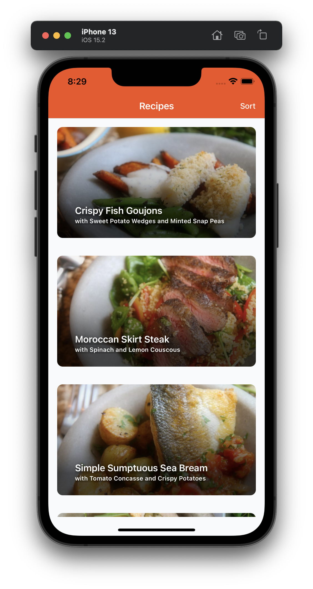
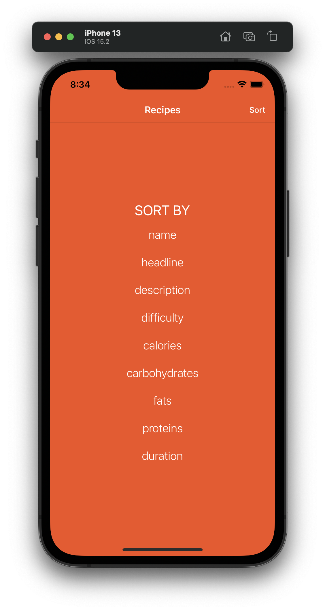
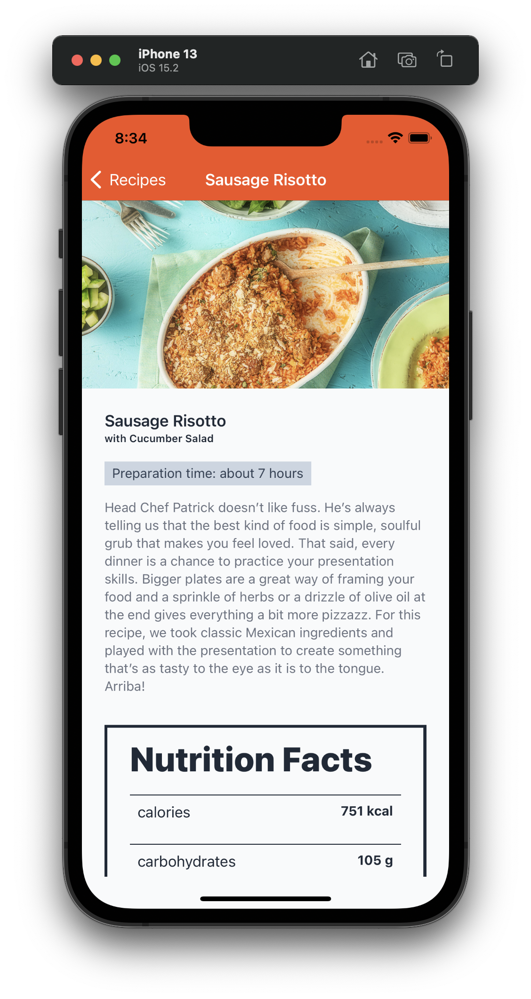

<!-- @format -->

<div id="top"></div>
<!--
*** Thanks for checking out the Best-README-Template. If you have a suggestion
*** that would make this better, please fork the repo and create a pull request
*** or simply open an issue with the tag "enhancement".
*** Don't forget to give the project a star!
*** Thanks again! Now go create something AMAZING! :D
-->

# LittleBits - A React Native recipes app





Highlights:

- Nice UX
- Good DX (Clean code, descriptive naming, well typed)
- Clean Architecture
- Tests with 100% coverage
- Theming with dark/light mode detection
- Native animations
- Custom hooks
- Reusable components
- Few but great dependencies

<!-- TABLE OF CONTENTS -->
<details>
  <summary>Table of Contents</summary>
  <ol>
    <li>
      <a href="#about-the-project">About The Project</a>
      <ul>
        <li><a href="#built-with">Built With</a></li>
        <li><a href="#architecture">Architecture</a></li>
        <li><a href="#navigation">Navigation concept</a></li>
      </ul>
    </li>
    <li>
      <a href="#getting-started">Getting Started</a>
      <ul>
        <li><a href="#prerequisites">Prerequisites</a></li>
        <li><a href="#installation">Installation</a></li>
      </ul>
    </li>
    <li><a href="#usage">Usage</a></li>
    <li><a href="#test">Test</a></li>
    <li><a href="#notes">Notes</a></li>
  </ol>
</details>

<!-- ABOUT THE PROJECT -->

## About The Project

<br>

![wireframe][wireframe-screenshot]

### Built With

- RN 0.68
- react-navigation v6
- recoil
- swr
- emotion
- date-fns
- duration-fns

<p align="right">(<a href="#top">back to top</a>)</p>

### Architecture

![Clean architecture][architecture-diagram]

Clean Architecture is a name popularized by Robert Cecil Martin, which is based on the premise of structuring the code in contiguous layers, that is, they only communicate with the layers immediately next to them. Based on this idea we can find articles that talk about Clean Architecture, Onion Architecture, Hexagonal Architecture, all of them have different approaches, but share the idea that each level must perform its own tasks and communicates only with its immediately adjacent levels.

In my years of experience as a developer, I have tried different approaches when starting a new project. The premise that I have tried to maintain as a base is to provide the project with a foundation that helps its growth and development. To do this, lately I have applied these principles and I can guarantee that the scalability and maintainability of the code is much greater, being able to invest less time in developing new functionalities or expanding existing ones.

#### Advantages

- **Independence**: each layer has its own paradigm or architectural model as if it were an application in itself without affecting the rest of the levels.

- **Structuring**: better organization of the code, facilitating the search for functionalities and navigation through it.

- **Decoupling**: Each layer is independent from the others so we could replace it or even develop on different technologies. In addition to reusing some of them in different projects.

- **Ease of testing**: we will be able to carry out unit tests of each of the layers and integration tests of the different layers with each other, being able to replace them with temporary objects that simulate their behavior in a simple way.

#### Disadvantages

- **Methodology**: The entire development team must be aware of the methodology being applied, and each developer must be responsible for understanding and applying the established rules as they develop.

- **Complexity**: the speed of development at the beginning of the project is lower because this structure must be established and the whole team must adapt to the new way of working, but little by little and as the application grows, maintenance and expansion will be more easy.

### Navigation

#### Motivation

Navigation configurations and routing (specially in mobile apps) often becomes really messy as the time passes by. As the code grows, navigators grow too, and it becomes even worse when nesting navigators.

#### Problem

When following every RN navigation example (to my knowledge), the page is a dependency of the navigator, and routing is done in a navigator file (in some cases including navigator in screens) which grows overtime, making the process of adding (or removing) a page more and more difficult.

#### Concept

![Clean architecture][tprp-diagram]

By using a registry pattern (more specifically a 3rd Party Registration pattern) we can load screens in a way that the navigator is a dependency of the page, and not the opposite.

![Clean architecture][navi2-diagram]

By doing so, adding or deleting a screen is just a matter of adding a screen to a Navigator and linking the file to the screens registry.

![Clean architecture][navi1-diagram]

<p align="right">(<a href="#top">back to top</a>)</p>

<!-- GETTING STARTED -->

## Getting Started

### Prerequisites

In order to Run this project you'll have to install [Node.js](https://nodejs.org/en/download/), [Yarn](https://yarnpkg.com/getting-started/install) and [set-up the **React Native CLI** environment](https://reactnative.dev/docs/environment-setup).

### Installation

1. Clone or download the repo and `cd` to project directory.
2. Install packages
   ```sh
   yarn install
   npx pod-install ios
   ```
### Usage

```sh
# for iOS
yarn ios

# for Android
yarn Android
```
> if a device is connected this command will install and run the app on your device, else it will run an emulator on your machine.

### Test

```sh
yarn test:gui
```
> This will start a server and open a new tab on your browser. Press **Run tests** to run all tests. You can also enable coverage collection though the interface bu pressing the *Collect coverage* icon.

### Notes

The completion to this state took a bit longer than expected due to multiple facts listed below:

* I found it difficult to allocate time since I'm currently going through a lot of interview processes in parallel.
* The environment on my personal computer wasn't properly set for the latest version of RN, therefore I had to set it up.
* Changes in RN's configurations were necessary because of the use of TypeScript, jest and some of the 3rd party packages.
* Decision of implementing the navigation concept after the initial planning.

With more time I could've included tests to the layout, hooks and states.

Also, due to tha lack of time and focus I didn't commit regularly. I'm well aware of that. I normally make better use of git. Sorry for that 😇.

#### Caveats

A fetch to the API will occur every time the user applies a sorting preference, this is done intentionally to simulate how things will happen in reality as often the sorting operation will be done in the backend.

<p align="right">(<a href="#top">back to top</a>)</p>

[wireframe-screenshot]: docs/images/wireframe.png
[architecture-diagram]: docs/images/arch.png
[tprp-diagram]: docs/images/tprp.png
[navi1-diagram]: docs/images/navi1.png
[navi2-diagram]: docs/images/navi2.png
